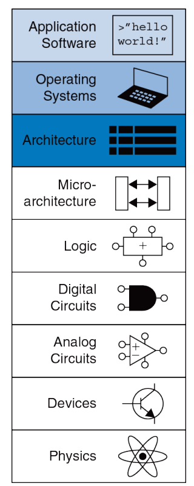

# Введение в "Архитектуру компьютеров"

```
В этом мире существует 10 видов людей: те, кто знакомы с двоичной системой счисления, и те, кто не знают о ней ничего.
```

## Что такое "Архитектура компьютера"?

На бытовом уровне термин «архитектура» у большинства людей прочно ассоциируется с различными зданиями и другими инженерными сооружениями. Так, можно говорить об архитектуре готического собора, Эйфелевой башни или оперного театра. 

В других областях этот термин применяется достаточно редко, однако для компьютеров понятие «архитектура ЭВМ» (электронно-вычислительная машина) уже прочно устоялось и широко используется, начиная с 70-х годов прошлого века. 

Для того чтобы разобраться в том, каким образом происходит выполнение программ, сценариев на компьютере, необходимо в первую очередь знать, как устроена работа каждой из его составляющих.

---

Структура огрганизации и архитектура компьютера разделена на разные уровни абстракции.



Мы начнём с самого близкого к нам уровня абстракций: 
- "Application Software" (уровень пользовательских приложений) 
- "Operating System" (уровень операционной системы) 

Допустим, у нас есть ноутбук (компьютер) у которого можно выделить основные составляющие, аппаратное обеспечение ("железо", hardware):
- Вычислительное устройство, процессор
- Оперативная память
- Жесткий диск
- Устройство ввода/вывода - клавиатура/экран

Уровень операционной системы: **Операционная система** (ОС, Operating system, OS) — это специальный набор программ, благодаря которому все системы компьютера взаимодействуют как между собой, так и с пользователем. 
Подробнее можно посмотреть [здесь](https://help.reg.ru/support/servery-vps/oblachnyye-servery/ustanovka-programmnogo-obespecheniya/chto-takoye-operatsionnaya-sistema#0)

Мы как пользователи хотим управлять нашим компьютером, например, попросить его запустить нашу программу, сложить два числа и вывести ответ на экран.


Для этого мы написали программу на одном из высокоуровневых языков: С/C++ для сложения двух чисел введенных пользователем.
```
// add_numbers.cpp

#include <iostream>
using namespace std;

int main() {

  int first_number, second_number, sum;
    
  cout << "Enter two integers: ";
  cin >> first_number >> second_number;

  // sum of two numbers in stored in variable sumOfTwoNumbers
  sum = first_number + second_number;

  // prints sum 
  cout << first_number << " + " <<  second_number << " = " << sum;     

  return 0;
}
```

Чтобы она сработала, нужно перевести код понимаемым человеком в код который понимает машина, это делает компилятор, про компилятор можно почитать [здесь](https://guides.hexlet.io/ru/compiler/);

На примере компилятора g++ (GNU Compiler Collection, gcc) для C++:
```
g++ add_numbers.ccp -o add_numbers
```

На выходе получаем исполняемый файл (Executable file), именно этот код уже понимает машина и если программа написана корректна, то при запуске программы:
```
./add_numbers
```

Можем получить результат:
```
Enter two integers: 2 2
2 + 2 = 4
```

Аппаратное обеспечение компьютера «понимает» только нули и единицы, поэтому инструкции закодированы двоичными числами в формате, который называется машинным языком.

Так же как мы используем буквы и прочие символы на письме для представления речи в виде, удобном для хранения, передачи и иных манипуляций, компьютеры используют двоичные числа, чтобы кодировать машинный язык.

Микропроцессоры – это цифровые системы, которые читают и выполняют команды машинного языка. Для людей чтение и написание компьютерных программ на машинном языке представляется нудным и утомительным, поэтому мы предпочитаем представлять инструкции в символическом формате, который называется языком ассемблера.

---
## Определение:

**_Архитектура компьютера_** – это его устройство и принципы взаимодействия его основных элементов – логических узлов, среди которых основными являются процессор, внутренняя память (основная и оперативная), внешняя память и устройства ввода-вывода информации.

**Архитектура компьютера** определяется набором команд (языком) и местом нахождения операндов (регистры и память). 
Существует множество разных архитектур, таких как: x86 (Intel, AMD), MIPS, SPARC и PowerPC.

Архитектура компьютера не определяет структуру аппаратного обеспечения, которое её реализует. Зачастую существуют разные аппаратные реализации одной и той же архитектуры. Например, компании Intel и Advanced Micro Devices (AMD) производят разные микропроцессоры, которые относятся к архитектуре x86. 

Все они могут выполнять одни и те же программы, но при этом в их основе лежит разное аппаратное обеспечение, поэтому эти процессоры имеют разное соотношение производительности, цены и энергопотребления.

Чтобы понять архитектуру любого компьютера, нужно в первую очередь выучить его язык. Слова в языке компьютера называются «инструкциями» или «командами», а словарный запас компьютера – «системой команд»

**Примечание:**
```
Иногда говорят, что команда – это двоичное представление слов на языке компьютера, то есть представление на уровне машинных кодов, а инструкция – это понятное человеку символьное представление этих слов на любом языке, включая язык ассемблера;
Мы будем считать слова «инструкция» и «команда» синонимами.
```

Почти все архитектуры определяют основные инструкции, такие как сложение, вычитание и переход, которые работают с ячейками памяти или регистрами.

Инструкция компьютера определяет операцию (operator, например сложение), которую нужно исполнить, и её операнды.

Операнды (operands) – это входные данные, с которыми производится операция, и получаемые результаты. Операнды могут находиться в памяти, в регистрах или внутри самой инструкции.


А что такое регистры?
Чтобы команды могли быстро выполняться, они должны быстро получать доступ к операндам. Но чтение операндов из памяти занимает много времени, поэтому большинство архитектур предоставляют небольшое количество регистров для хранения наиболее часто используемых операндов.

Даже сложные приложения, такие как редакторы текста и электронные таблицы, в конечном итоге состоят из последовательности таких простых команд, как сложение, вычитание и сдвига (переход).

---

### С какой архитектуры лучше всего начать изучение предмета? 

Изучение коммерчески успешных архитектур, например, Intel x86, имеет практический смысл потому, что зная их, можно писать программы для настоящих компьютеров. 

К сожалению, многие из этих архитектур полны исторических нагромождений и причуд, накопленных за годы не всегда согласованной работы разных команд инженеров. 

Мы сфокусируемся на архитектуре [MIPS](https://mcucpu.ru/index.php/ucontrollers/mcu/57-mips). 

В мире произведены сотни миллионов микропроцессоров MIPS, что говорит о бесспорной практической важности этой архитектуры (Cогласно официальным данным от Imagination Technologies, лицензиара ядер и архитектуры MIPS, число произведенных процессоров MIPS превышает 3,5 миллиарда, причем за один только 2014 финансовый год – 728 миллионов). При этом она остаётся достаточно ясной и имеет минимальное количество странностей. 

---

Чтобы командовать компьютером, нужно разговаривать на его языке. Архитектура компьютера определяет, как именно нужно это делать. На сегодняшний день в мире широко используется большое количество разных архитектур, но если вы хорошо поймете одну из них, то изучить остальные будет довольно просто. 

При изучении новой архитектуры вы должны задать следующие главные вопросы: 
- Какова длина слова данных?
- Какие регистры доступны?
- Как организована память? 
- Какие есть инструкции? 

Важность определения компьютерной архитектуры заключается в том, что программа, написанная для выбранной архитектуры, будет работать на совершенно разных реализациях этой архитектуры. Например, программы, написанные для процессора Intel Pentium в 1993 году, будут в общем случае работать (причем работать значительно быстрее) на процессорах Intel Xeon или AMD Phenom в 2012 году.

---

Введение в следующие темы:

- Классическая архитектура фон Неймана
- Архитектура современных компьютеров
- Нейроморфная архитектура
- Квантовые компьютеры 

Можно прочитать [здесь](https://skysmart.ru/articles/programming/arhitektura-kompyutera)

Про квантовые компьютеры рекомендую прочитать [здесь](https://vas3k.blog/blog/quantum_computing/)

---

# Ссылки и материалы:

1. Цифровая схемотехника и архитектура компьютера второе издание Дэвид М. Харрис и Сара Л. Харрис. Глава Архитектура.
2. [Архитектура компьютеров - SkySmart](https://skysmart.ru/articles/programming/arhitektura-kompyutera)
3. [Операционная система](https://help.reg.ru/support/servery-vps/oblachnyye-servery/ustanovka-programmnogo-obespecheniya/chto-takoye-operatsionnaya-sistema#0)
4. [Компилятор](https://guides.hexlet.io/ru/compiler/)
5. [MIPS](https://mcucpu.ru/index.php/ucontrollers/mcu/57-mips)
6. [Квантовые компьютеры](https://vas3k.blog/blog/quantum_computing/)
