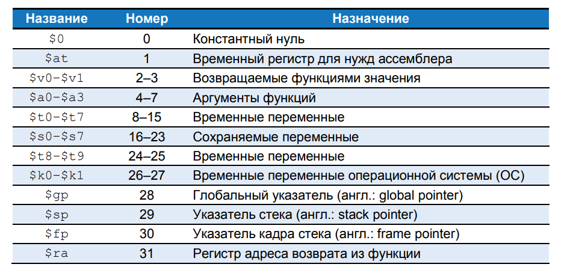
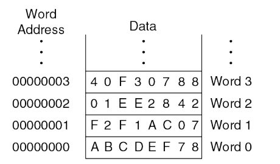
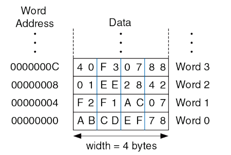
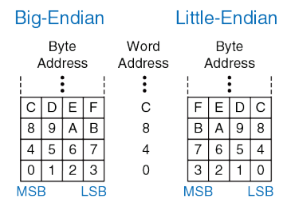

# Язык ассемблера

Язык ассемблера – это удобное для восприятия человеком представление родного (native) языка компьютера. Каждая инструкция языка ассемблера задаёт операцию, которую необходимо выполнить, а также операнды, которые будут использованы во время выполнения. 

## Инструкции

Наиболее частая операция, выполняемая компьютером – это сложение.

Код на языке высокого уровня:
```
a = b + c;
```

Код на языке ассемблера MIPS:
```
add a, b, c
```

Первая часть инструкции ассемблера, **add**, называется мнемоникой и определяет, какую операцию нужно выполнить.

Операция осуществляется над **b** и **c**, **операндами-источниками** (или просто операндами)
а результат записывается в **a**, **операнд-назначение** (или результатом)

> Мнемоники языка ассемблера запомнить проще, чем наборы нулей и единиц машинного языка, представляющих ту же операцию.

Следующая операция - вычитание. Формат инструкции такой же, как у инструкции add, только операция называется **sub**.

Код на языке высокого уровня:
```
a = b - c;
```

Код на языке ассемблера MIPS:
```
sub a, b, c
```

Подобное сходство не ограничивается лишь этими двумя инструкциями. Единообразный формат для команд является примером первого принципа хорошей разработки:

**Первое правило хорошей разработки: для простоты придерживайтесь единообразия**

Инструкции с одинаковым количеством операндов – в нашем случае с двумя операндами-источниками и одним операндом-назначением (то есть с двумя операндами и одним результатом) – проще закодировать и выполнять на аппаратном уровне.

Более сложный высокоуровневый код преобразуется во множество инструкций MIPS:

Код на языке высокого уровня:
```
a = b + c − d; // single-line comment 
               /* multiple-line comment */
```

Код на языке ассемблера MIPS:
```
sub t, c, d    # t = c − d 
add a, b, t    # a = b + t
```

Использование нескольких инструкций ассемблера для выполнения более сложных операций является иллюстрацией второго принципа хорошей разработки компьютерной архитектуры:

**Второе правило хорошей разработки: Типичный сценарий должен быть быстрым**

При использовании системы команд MIPS типичный сценарий становится быстрым потому, что она включает в себя только простые и постоянно используемые команды. Количество команд специально оставляют небольшим, чтобы аппаратное обеспечение для их поддержки было простым и быстрым. Более сложные операции, используемые не так часто, выполняются при помощи последовательности нескольких простых команд.

По этой причине MIPS относится к компьютерным архитектурам с сокращенным набором команд (англ.: reduced instruction set computer, **RISC**).

Архитектуры с большим количеством сложных инструкций, такие как архитектура x86 от Intel, называются компьютерами со сложным набором команд (англ.: complex instruction set computer, **CISC**).

Например, x86 определяет инструкцию «перемещение строки», которая копирует строку  (последовательность символов) из одной части памяти в другую. 

Такая операция требует большого количества, вплоть до нескольких сотен, простых инструкций на RISC-машине.

С другой стороны, реализация сложных инструкций в архитектуре CISC требует дополнительного аппаратного обеспечения и увеличивает накладные расходы, которые замедляют простые инструкции.

Архитектура RISC использует небольшое множество различных команд, что уменьшает сложность аппаратного обеспечения и размер инструкций. 

Например, код операции в системе команд, состоящей из 64 простых инструкций, потребует 

$$\log_2 64 = 6$$

6 - бит

А в системе команд из 256 сложных инструкций потребует уже - 8 бит:
$$\log_2 256 = 8$$
В CISC-машинах сложные команды, даже если они используются очень редко, увеличивают накладные расходы на выполнение всех инструкций, включая и самые простые.

## Операнды: регистры, память и константы

Инструкция работает с операндами. В примерах кода выше переменные a, b и c являются операндами. Но компьютеры оперируют нулями и единицами, а не именами переменных.

Инструкция должна знать место, откуда она сможет брать двоичные данные. Операнды могут находиться в регистрах или памяти, а еще они могут быть константами, записанными в теле самой инструкции.

Компьютеры используют различные места для хранения операндов, чтобы повысить скорость исполнения и/или более эффективно размещать данные. 

Обращение к операндам-константам или операндам, находящимся в регистрах, происходит быстро, но они могут вместить лишь небольшое количество данных. 

Остальные данные хранятся в ёмкой, но медленной памяти. Архитектуру MIPS называют 32-битной потому, что она оперирует 32-битными данными (в некоторых коммерческих продуктах архитектура MIPS была расширена до 64 бит).

### Регистры

Чтобы команды могли быстро выполняться, они должны быстро получать доступ к операндам. Но чтение операндов из памяти занимает много времени, поэтому большинство архитектур предоставляют небольшое количество регистров для хранения наиболее часто используемых операндов. 

Архитектура MIPS использует 32 регистра, которые называют набором регистров или регистровым файлом. Чем меньше количество регистров, тем быстрее к ним доступ. Это приводит нас к третьему правилу хорошей разработки компьютерной архитектуры:

**Третье правило хорошей разработки: Чем меньше, тем быстрее**

Найти необходимую информацию получится гораздо быстрее в небольшом количестве тематически подобранных книг, лежащих на столе, а не в многочисленных книгах, находящихся на полках в библиотеке. 

То же самое и с чтением данных из регистров и памяти. Прочитать данные из небольшого набора регистров (например, из 32 регистров) можно гораздо быстрее, чем из 1000 регистров или из большой памяти.

Небольшие регистровые файлы обычно состоят из маленького массива памяти SRAM. 
Такой массив использует небольшой дешифратор адреса, подключенный битовыми линиями к относительно малому количеству ячеек памяти, благодаря чему цепи с наибольшей задержкой получаются короче, чем при доступе к большой памяти.

Инструкция add с регистровыми операндами:

```
// Код на языке высокого уровня:
a = b + c

Код на языке ассемблера MIPS
# $s0 = a, $s1 = b, $s2 = c 
add $s0, $s1, $s2     # a = b + c
```

Имена регистров MIPS начинаются со знака $. 

Переменные a, b и c размещены в регистрах $s0, $s1 и $s2. 
Имя $s1 произносят как «регистр s1» или «доллар s1». 

Инструкция складывает 32-битные значения, хранящиеся в $s1 (b) и $s2 (c) и записывает 32-битный результат в $s0 (a).
MIPS обычно хранит переменные в 18 из 32 регистров: $s0 - $s7 и $t0 - $t9.
Регистры которые начинаются с $s - сохраняемые регистры (saved).

В соответствии с соглашением об использовании регистров MIPS эти регистры используются для размещения в них переменных таких, как a, b и c.
Сохраняемые регистры имеют особое значение в контексте вызова процедур. 

Регистры, имена которых начинаются с $t - временные регистры (temporary).
Они используются для хранения временных переменных.

В архитектуре MIPS регистры разделены на две категории: 
Оберегаемые (preserved) регистры – `$s0–$s7` (сохраняемые, saved). 
необерегаемые (nonpreserved) регистры – `$t0–$t9` (временные, temporary). 

Пример с использованием временной переменной:

```
// Код на языке высокого уровня a = b + c − d; 

Код на языке ассемблера MIPS 
# $s0 = a, $s1 = b, $s2 = c, $s3 = d 
sub $t0, $s2, $s3    # t = c − d 
add $s0, $s1, $t0    # a = b + t
```

Использование сохраняемых и временных регистров важно при вызове функций:
Функция должна сохранять и восстанавливать любые оберегаемые регистры, с которыми она собирается работать, но может свободно менять значения необерегаемых регистров. Мы рассмотрим это в следующих темах. 

> Трансляцией называется процесс преобразования программы, написанной на одном языке программирования, в программу на другом языке.


### Набор регистров

В архитектуре MIPS определено 32 регистра общего назначения. У каждого регистра есть имя и порядковый номер от 0 до 31.



### Память

Если бы операнды хранились только в регистрах, то мы могли бы писать лишь простые программы, содержащие не более 32 переменных. 

Поэтому данные также можно хранить в памяти. По сравнению с регистровым файлом память имеет много места для хранения данных, но доступ к ней занимает больше времени. По этой причине часто используемые переменные хранятся в регистрах. Комбинируя память и регистры, программа может получать доступ к большим объёмам данных достаточно быстро.

Память устроена как массив слов с данными. Архитектура MIPS использует 32 битные адреса памяти и 32-битные слова с данными (длина слова).

MIPS использует побайтовую адресацию памяти. Это значит, что каждый байт памяти имеет уникальный адрес. Однако, для лучшего понимания, мы сначала рассмотрим пословную адресацию памяти, а потом посмотрим побайтовую адресацию памяти в MIPS.

Массив памяти с пословной адресацией:


Видно, что каждое 32-битное слово данных (англ.: word) имеет уникальный 32-битный адрес (англ.: word address). 

И 32-битные адреса слов, и 32-битные значения (англ.: data) записаны в шестнадцатеричной системе счисления.

Как видно из рисунка, для слова Word 1, значение 0xF2F1AC07 хранится в памяти по адресу 1 (шестнадцатеричные числа часто записываются с префиксом 0x).

При графическом изображении памяти традиционно размещают меньшие адреса внизу, а большие – наверху.

MIPS использует команду загрузить слово (англ.: load word), lw, для чтения слова данных из памяти в регистр.
Инструкция lw определяет эффективный адрес в памяти как сумму базового адреса и смещения. Базовый адрес (записан в скобках в инструкции) является регистром. Смещение (записано перед скобками) является константой.

**Код на языке ассемблера**
```
# This assembly code (unlike MIPS) assumes word-addressable memory 
lw $s3, 1($0) # read memory word 1 into $s
```

Базовый адрес – это регистр $0, содержащий значение 0, а сдвиг – это 1, поэтому инструкция lw читает значение из памяти по адресу ($0 + 1) = 1. После выполнения команды загрузки слова (lw) в $s3 появляется значение 0xF2F1AC07, которое находилось в памяти по адресу 1

Аналогичным образом MIPS использует инструкцию сохранить слово (англ.: store word), sw, для записи данных из регистра в память.

Пример, программа записывает значение регистра $s7 в слово памяти с адресом 5. 
```
# This assembly code (unlike MIPS) assumes word-addressable memory
sw $s7, 5($0)   # write $s7 to memory word 5
```

Эти примеры для простоты использовали $0 в качестве базового адреса, но на самом деле для указания базового адреса можно использовать любой регистр.

В двух предыдущих примерах показана компьютерная архитектура с пословной адресацией памяти. Но модель памяти MIPS имеет не пословную, а побайтовую адресацию, при которой каждый байт данных имеет уникальный адрес.

Так как 32-битное слово состоит из четырёх 8-битных байтов, то адрес каждого слова (англ.: word address) кратен четырём, как показано на рисунке:



где 32-битные адреса и значения слов тоже представлены в шестнадцатеричной системе счисления.

Далее показано, как читать и записывать слова в память MIPS, адресуемую побайтно.

Код на языке ассемблера MIPS 
```
lw $s0, 0($0)    # read data word 0 (0xABCDEF78) into $s0 
lw $s1, 8($0)    # read data word 2 (0x01EE2842) into $s1 
lw $s2, 0xC($0)  # read data word 3 (0x40F30788) into $s2
sw $s3, 4($0)    # write $s3 to data word 1 
sw $s4, 0x20($0) # write $s4 to data word 8 
sw $s5, 400($0)  # write $s5 to data word 100
```

Адрес слова – это порядковый номер слова, умноженный на четыре. 

Программа на ассемблере MIPS читает слова 0, 2 и 3 и записывает слова 1, 8 и 100. Смещение может быть записано в десятичной или шестнадцатеричной системе счисления (в этом примере смещение 400 и порядковый номер 100 – десятичные числа).

Архитектура MIPS также включает инструкции lb и sb, которые загружают и сохраняют отдельные байты, а не слова.

Память с побайтовой адресацией может быть организована с прямым порядком следования байтов (от младшего к старшему; англ.: little-endian) или с обратным порядком (от старшего к младшему; англ.: big-endian), как показано на рисунке:



В обоих случаях самый старший байт (англ.: most significant byte, MSB) находится слева, а самый младший байт (англ.: least significant byte, LSB) – справа.

В машинах с прямым порядком следования байты пронумерованы от 0, начиная с самого младшего байта. В машинах с обратным порядком следования байты пронумерованы от 0, начиная с самого старшего байта. Пословная адресация одинакова в обеих моделях, то есть один и тот же адрес слова указывает на одни и те же четыре байта. Отличаются только адреса байтов (англ.: byte addresses) внутри слова.

Процессор PowerPC компании IBM, который ранее использовался в компьютерах Apple Macintosh, имеет обратный порядок следования байтов. Архитектура x86 компании Intel, которая используется в персональных компьютерах, имеет прямой порядок следования байтов.

Некоторые процессоры MIPS используют прямой порядок, другие – обратный.
Выбор порядка следования байтов абсолютно произволен, но он ведёт к проблемам при обмене данными между компьютерами с разным порядком байтов.

В архитектуре MIPS адреса слов для команд lw и sw должны быть выровнены по словам (англ.: word aligned), то есть адреса должны делиться на 4 без остатка. 
Таким образом, инструкция(load word) `lw $s0, 7($0)` является некорректной. 
Некоторые архитектуры, такие как x86, позволяют производить операции чтения и записи данных по невыровненным адресам, но MIPS требует строгого выравнивания из соображений простоты аппаратной реализации.

Разумеется, адреса байтов в командах загрузки и сохранения байтов (`lb` и `sb`) не обязательно должны быть выровнены по словам

### Константы/Непосредственные операнды

Команды загрузки и сохранения слова (lw и sw) также демонстрируют использование констант в командах MIPS. 

Эти константы называют непосредственными операндами (англ.: immediate), потому что их значения находятся непосредственно внутри команды и не требуют обращения к регистрам или памяти. 

Еще одна часто используемая команда MIPS, использующая непосредственный операнд – это команда сложения с константой addi (англ.: add immediate), которая прибавляет константу к значению регистра

Код на языке высокого уровня
```
a = a + 4; 
b = a − 12;
```

Код на языке ассемблера MIPS:
```
# $s0 = a, $s1 = b 
addi $s0, $s0, 4       # a = a + 4 
addi $s1, $s0, −12     # b = a – 12
```

Константа, находящаяся внутри команды, является 16-битным числом, представленным в дополнительном коде, и может принимать значения из диапазона [–32,768; 32,767].

Так как вычитание эквивалентно сложению с отрицательным числом, то для простоты реализации в архитектуре MIPS отсутствует команда subi.

Вспомните, что инструкции add и sub используют в качестве операндов три регистра, а инструкции lw, sw и addi – два регистра и константу. Так как форматы инструкций отличаются, то получается, что команды lw и sw нарушают первое правило хорошей разработки, гласящее, что для простоты нужно придерживаться единообразия. Однако этот случай позволяет нам представить последнее правило хорошей разработки:

**Четвертое правило хорошей разработки: она требует хороших компромиссов**

Единый формат инструкций будет простым, но негибким. В системе команд MIPS в качестве компромисса поддерживается три формата инструкций:

1. Первый формат используется для инструкций типа add и sub, у которых есть три регистровых операнда.
2. Второй формат для инструкций типа lw и addi, у которых есть два регистровых операнда и 16-битная константа (непосредственный операнд).
3. Третий формат мы рассмотрим позже – он предназначен для инструкций, которым нужна 26-битная константа и не нужны регистровые операнды.

---

# Ссылки и материалы:

1. Цифровая схемотехника и архитектура компьютера второе издание Дэвид М. Харрис и Сара Л. Харрис. Глава 6. Архитектура, подраздел 6.2