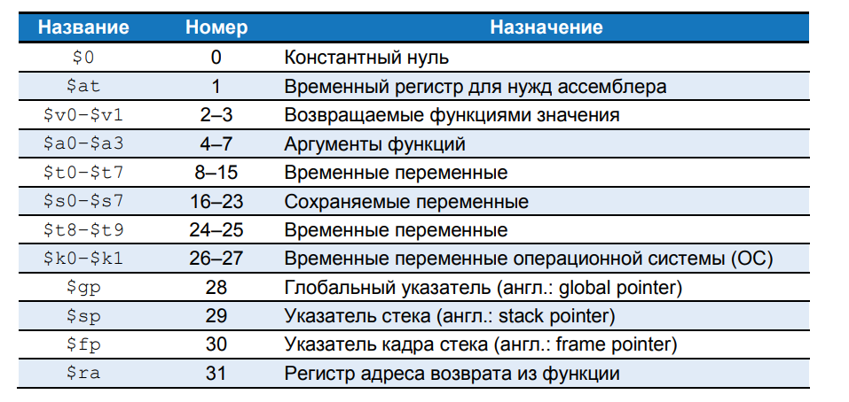

# Машинный язык

Язык ассемблера удобен для чтения человеком, но цифровые схемы понимают только нули и единицы. Поэтому программу, написанную на языке ассемблера, переводят из последовательности мнемоник в последовательность нулей и единиц, которую называют машинным языком. 

Для простоты нужно придерживаться единообразия, и наиболее единообразным представлением команд в машинном языке было бы такое, где каждая команда занимала бы ровно одно слово памяти. 

Длина команд в архитектуре MIPS составляет 32 бита, при этом некоторые из них используют только часть из этих бит. И хотя можно было бы сделать длину команд переменной, это излишне усложнило бы архитектуру.

Для простоты можно было бы также определить единый формат для всех инструкций, но, как уже говорилось, такой подход обернулся бы серьезными ограничениями.

В архитектуре MIPS в качестве компромисса используются три формата инструкций: 
- типа R (использую три регистровых операнда)
- типа I (используют два регистровых операнда и 16-битную константу)
- типа J (используют 26-битную константу)

Небольшое количество форматов обеспечивает определенное единообразие между всеми тремя типами и, как следствие, более простую аппаратную реализацию. 
При этом разные форматы позволяют учитывать различные потребности инструкций, как, например, необходимость хранить большие константы внутри инструкций. 

## Инструкции типа R

Название типа R является сокращением от регистрового типа (англ. register-type).

Инструкции типа R используют три регистра в качестве операндов: два регистра-источника и один регистр-назначение.

32-битная команда состоит из шести полей: op, rs, rt, rd, shamt и funct. Каждое поле состоит из пяти или шести бит.

Операция, выполняемая командой, закодирована двумя полями, отмеченными синим цветом: 
- полем op (также называемым opcode или кодом операции) 
- полем funct (также называемым функцией).

Операция, выполняемая этими командами, определяется исключительно полем **funct**. 

Например, поля **opcode** и **funct** у инструкции **add** равны 0 (000000) и 32 (100000) соответственно. Аналогично, у команды **sub** поля **opcode** и **funct** равны 0 и 34.

Операнды закодированы тремя полями: rs (register source), rt и rd (register destination).
Поля содержат номера регистров, приведенные в таблице:

Например, $s0 – это регистр с номером 16. 

Регистры rs и rt являются регистрами источниками, а rd – регистром-назначением (или регистром результата).

Пятое поле, **shamt**, используется только для операций сдвига.
В таких командах двоичное значение, хранимое в 5-битном поле shamt, задаёт величину сдвига (англ.: shift amount). У всех остальных команд типа R поле shamt равно 0.

На рисунке показан машинный код для двух инструкций типа R – add и sub.
Обратите внимание на то, что в инструкции на языке ассемблера регистр-назначение идёт первым, а в команде на машинном языке он третий. 

Например, в ассемблерной инструкции add $s0, $s1, $s2 
поле rs = $s1 (17), поле rt = $s2 (18), а поле rd = $s0 (16).

## Инструкции типа l

Название типа I является сокращением от непосредственного типа (англ. immediate-type). Инструкции типа I используют в качестве операндов два регистра и один непосредственный операнд (константу).

Показан формат машинной команды типа I. 
32-битная команда состоит из четырёх полей: op, rs, rt и imm. 
Первые три поля (op, rs и rt) аналогичны таким же полям в командах типа R. 
Поле imm (сокр. от англ. immediate) содержит 16-битную константу.

Операция определяется исключительно полем opcode, отмеченным синим цветом. 
Операнды заданы в трёх полях: rs, rt и imm. 

Поля rs и imm всегда используются как операнды-источники. Поле rt в некоторых командах (например, addi и lw) содержит номер регистра-назначения, в других (например, sw) – номер регистра-источника.

На рисунке приведено несколько примеров кодирования инструкций типа I. 

Вспомним, что отрицательные значения констант записывают в виде 16-битных чисел, представленных в дополнительном коде. В инструкции на языке ассемблера поле **rs** указывают первым в том случае, когда оно содержит номер регистра-назначения, но в команде машинного языка оно всегда является вторым по счету.

Инструкции типа I содержат 16-битную константу imm, но константы участвуют в 32-битных операциях. Например, инструкция lw добавляет 16-битное смещение к 32-битному базовому адресу. 
Что же произойдёт в верхних 16 битах? 16-битные константы сначала будут расширены до 32 бит следующим образом: у неотрицательных констант верхние 16 бит будут заполнены нулями, а у отрицательных констант они будут заполнены единицами (этот приём называется расширением знака).

>N-битное число расширяется знаком до M-битного числа (M > N) путём копирования знакового (старшего) бита N-битного числа во все старшие биты M-битного числа. Расширение знака у числа, представленного в дополнительном коде, не меняет его значения. После расширения константы будет выполнена основная операция инструкции.

## Инструкции типа J

Название типа J является сокращением от английского слова прыжок (англ.: jump). Этот формат используется только для инструкций безусловного перехода и ветвления (if else).

Как показано на рисунке, в формате команд этого типа определён только один 26-битный операнд **addr**:

Как и другие команды, команды типа J начинаются с 6-битного поля кода операции (opcode). Оставшиеся биты используются для указания адреса перехода (addr).

## Расшифровываем машинные коды

Чтобы понимать язык машины, нужно уметь расшифровывать поля каждой 32-битной команды. Для разных команд определены разные форматы, но во всех форматах команды начинаются с 6-битного поля opcode. 

Если оно равно 0, то это команда типа R, иначе это команда типа I или J.

Задача, трансляция приведенных ниже машинных кодов на язык ассемблера:
- 0x2237FFF1 
- 0x02F34022

Cначала запишем машинные коды в двоичном коде и посмотрим на шесть самых старших бит, чтобы выяснить код операции (opcode) каждой из команд. Код операции скажет нам, как нужно интерпретировать оставшиеся биты.

001000 - первые 6 бит, данный opcode соответствует коду операции - 8, addi. (сложение с константой), команда типа R.

Для второй инструкции:
000000 - первые 6 бит, соответствуют opcode - 0. Что соответствует команде типу R. 
Поле funct команды типа R равно 100010 (3),  что соответствует команде sub.

## Могущество хранимой программы 

Программа, написанная на машинном языке – это последовательность чисел (в архитектуре MIPS – 32-битных чисел), представляющих инструкции. 

Как и любые другие двоичные числа, эти инструкции можно хранить в памяти. 

Этот подход называется концепцией хранимой программы (англ.: stored program concept), и в нём заключается главная причина могущества компьютеров. 

Запуск новой программы не требует больших затрат времени и усилий на изменение или реконфигурацию аппаратного обеспечения; всё, что для этого необходимо – записать новую программу в память. 

Хранимые программы, в отличие от жестко зафиксированного аппаратного обеспечения, выполняющего лишь строго определенные функции, позволяют осуществлять вычисления общего назначения (англ.: general purpose computing). Используя этот подход, компьютер может выполнять любые приложения, начиная от простого калькулятора и заканчивая текстовыми процессорами и проигрывателями видео, просто меняя хранимую программу. 

В хранимой программе команды считываются, или выбираются (англ.: fetch) из памяти и выполняются процессором. Даже большие и сложные программы превращаются в последовательность операций чтения из памяти и выполнения команд.

На рисунке показано, как машинные команды хранятся в памяти. 
В программах для MIPS команды обычно хранятся, начиная с адреса 0x00400000. Вспомним, что адресация памяти в архитектуре MIPS побайтовая, поэтому 32-битные (4-байтовые) адреса команд кратны четырём байтам, а не одному.

Чтобы запустить, или выполнить, хранимую программу, процессор последовательно выбирает ее команды из памяти. 
Далее выбранные команды расшифровываются (дешифруются) и выполняются аппаратным обеспечением. Адрес текущей команды хранится в 32-битном регистре, который называют счётчиком команд (англ.: program counter, PC). Счётчик команд – это отдельный регистр, он не связан с 32 регистрами общего назначения.

Для того чтобы выполнить код показанный на рисунке выше, 

1. Операционная система загружает в счётчик команд значение 0x00400000. 
2. Процессор читает из памяти по этому адресу команду 0x8C0A0020 и выполняет ее. 
3. Затем процессор увеличивает значение счётчика команд на 4 (оно становится равным 0x00400004), выбирает из памяти и выполняет новую команду, после чего процесс повторяется.

Архитектурное состояние (англ.: architectural state) микропроцессора содержит состояние программы. 

Архитектурное состояние процессоров MIPS включает в себя содержимое регистрового файла и счётчика команд. Если операционная система в какой-либо момент выполнения программы сохранит архитектурное состояние, то сможет эту программу прервать, сделать что-то ещё, а потом восстановить архитектурное состояние, после чего прерванная программа продолжит выполняться, даже не узнав, что её вообще прерывали (строго говоря, архитектурное состояние также включает в себя и содержимое памяти, где расположены команды и данные выполняющейся программы).

