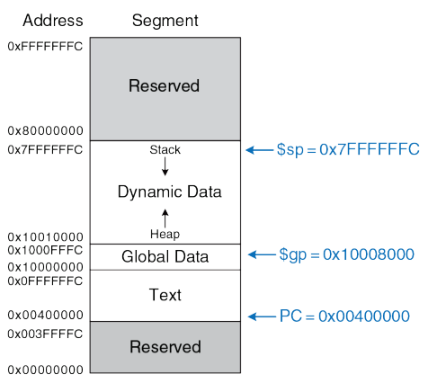
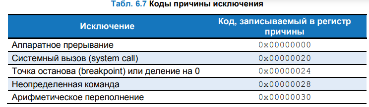

# Карта памяти

Так как архитектура MIPS использует 32-битные 
адреса, то размер адресного пространства составляет 

$$\ 2^{32}\ байта\ =\ 4\ гигабайта\ (Гбайт)$$

Адреса слов кратны 4 и располагаются в промежутке 
от <b>0</b> до <b>0xFFFFFFFC</b>. На рисунке изображена карта 
памяти MIPS.

Адресное пространство разделено на четыре части, 
или сегмента: сегмент кода, сегмент глобальных 
данных, сегмент динамических данных и 
зарезервированный сегмент. Эти сегменты 
рассматриваются в следующих 

## Сегмент кода

<b>Сегмент кода</b> (англ.: text segment) содержит 
машинные команды исполняемой программы. Его 
размер достаточен для размещения почти <b>256</b> Мбайт 
кода. Обратите внимание, что четыре старших бита

адреса в сегменте кода всегда равны нулю, что 
позволяет использовать инструкцию j для перехода по 
любому адресу в программе
## Сегмент глобальных данных
<b>Сегмент глобальных данных</b> содержит глобальные 
переменные, доступные всем функциям программы. 
Их инициализация происходит при загрузке 
программы, но до ее выполнения. Размер сегмента - 
64 Кбайт. Глобальные переменные объявляются вне 
функции main в языке Си. Доступ осуществляется 
через глобальный указатель (<b>$gp</b>), который не 
меняется во время выполнения. Глобальные 
переменные доступны по смещению относительно 
<b>$gp</b>. Для доступа к ним используется режим базовой 
адресации с константными смещениями
## Сегмент динамических данных
<b>Сегмент динамических данных</b> включает стек и кучу, 
которые используются для динамического выделения 
и освобождения данных в процессе выполнения 
программы. Стек используется для сохранения 
регистров и хранения локальных переменных, а куча 
для выделения блоков памяти. Размер сегмента 
составляет почти 2 Гбайт. Стек растет вниз от 
верхней границы, а доступ к нему осуществляется в 
режиме LIFO. Куча растет вверх от нижней границы. 
Ошибка <b>out-of-memory</b> возникает, если недостаточно 
свободной памяти для выделения новых данных.
## Зарезервированный сегмент
<b>Зарезервированный сегмент</b> операционной системы содержит память для прерываний и отображения 
устройств ввода-вывода. При возникновении исключения процессор копирует счетчик команд в регистр 
EPC и записывает код причины исключения в регистр. Коды <b>0x28</b> и <b>0x30</b> означают неопределенную команду 
и арифметическое переполнение соответственно. Затем процессор переходит к обработчику исключения по 
адресу <b>0x80000180</b>, который является частью операционной системы

